# GNS3环境搭建

## 1.安装GNS3软件
文档中介绍使用的是2.1.9版本，此文档编辑时最新的版本是2.1.10。如果需要下载最新版可以到官网下载。<br>
地址：[https://www.gns3.com/software](https://www.gns3.com/software)<br>

安装方法非常简单只有一路确认即可，其中对组件特别说明一下：<br>
<br>

SolarWinds Response Time Viewer for Wireshark:这是Wireshark的辅助分析工具，需要在线下载，文件大，耗时长，不建议安装。把勾选去掉，如上图，其他默认安装。<br>
对于Wireshark可以一并安装，也可以单另自行安装。<br>

<br>

安装路径自行规划，但不要出现中文。<br>

## 2.GNS3配置
<br>
<br>
<br>
<br>
<br>
配置完成后点击Apply。<br>

我们在GNS3软件的目录下面再创建一个空目录，并把以前下载i86的镜像文件复制进去：<br>
<br>
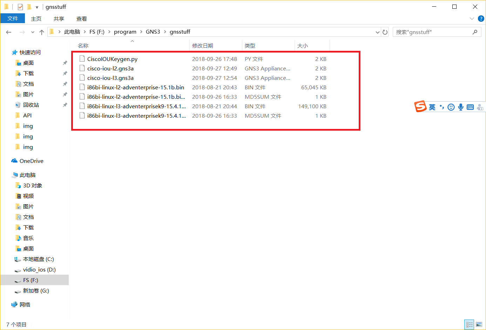<br>

## 3.添加路由设备
我们把模拟Ciso路由器的操作系统放在虚拟机上这样我们可以很好的控制Ciso操作系统的资源占有率。<br>
<br>
<br>
<br>
<br>
我的计算机有CPU 8核 建议给本机的一半CPU，内存16G 给了4G。<br>

<br>
<br>
我们点击下一步，虚拟机就会自己启动。<br>
可以看到虚拟机启动后显示的版本号，IP地址等，比较重要的是，这里给出的SSH登录虚拟机的帐号默认为：gns3，密码：gns3。如果想要登录到虚拟机内，可以用这个帐号登录<br>

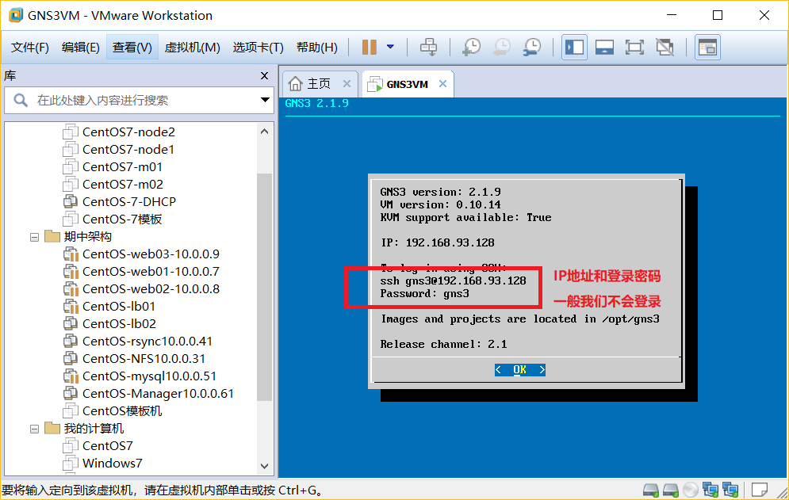<br>
<br>

现在我们在虚拟机上模拟Ciso路由器。<br>
<br>
<br>
<br>
<br>
<br>
<br>

我们现在要计算I-dle值，这个值影响Ciso路由器占有硬件资源多少，每台计算机的值都不同,如下。<br>
<br>
<br>
我们点击Finish，这样我们的ciso路由器就创建完成了。<br>
<br>

但是现在我们的这台路由器还没有足够的接口，我们给路由器添加一些串口(公网路由器之间连接的接口)和并口(和以太网交换机连接的接口)。<br>
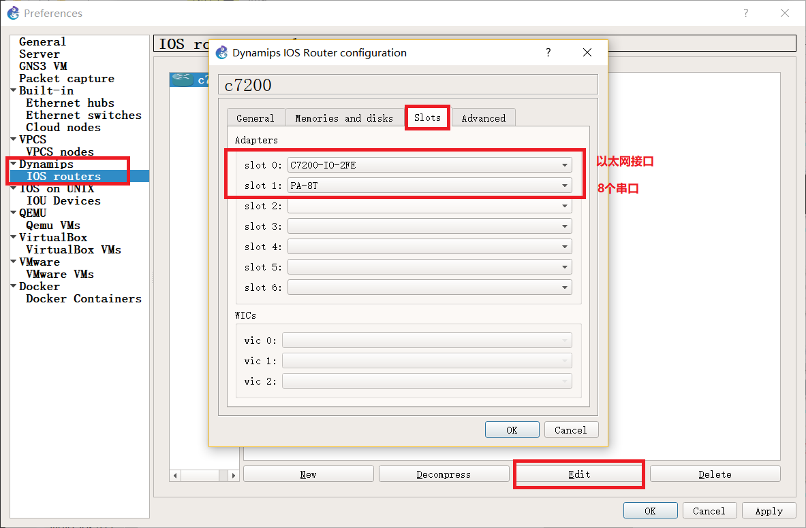<br>
配置完成后点击Apply。<br>

**我们做一个测试**<br>
新建一个项目：<br>
<br>
<br>
把我们的路由器拉出来。<br>
<br>
再拉出几个交换机来：<br>
<br>
我们把这些设备连接起来(注意连接的端口)：<br>
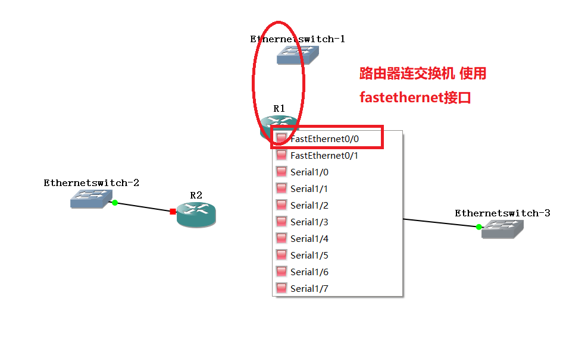<br>
<br>
全部点亮：<br>
<br>

## 4.添加交换机设备
### 里程碑一 添加License
我们使用Xshell连接上我们的GNS VM虚拟机，选择Shell如下：<br>
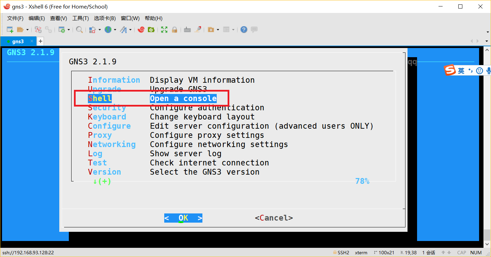<br>

在当前目录下面创建一个``.py``文件。<br>
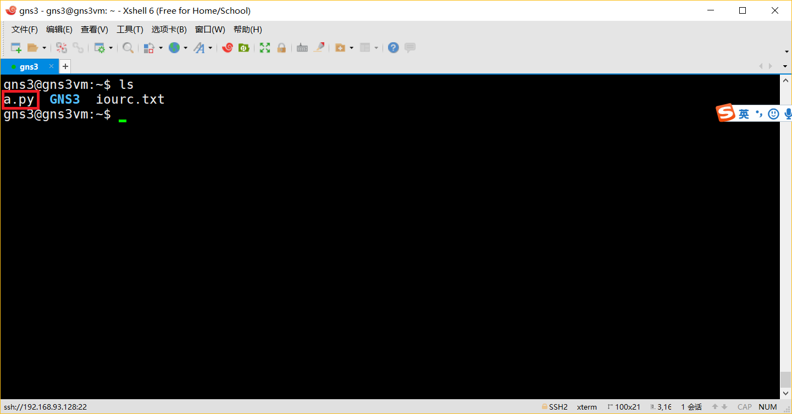<br>

我们把下面的信息复制到``.py``文件中。<br>
```python
#! /usr/bin/python
print("*********************************************************************")
print("Cisco IOU License Generator - Kal 2011, python port of 2006 C version")
print("Modified to work with python3 by c_d 2014")
import os
import socket
import hashlib
import struct

# get the host id and host name to calculate the hostkey
hostid=os.popen("hostid").read().strip()
hostname = socket.gethostname()
ioukey=int(hostid,16)
for x in hostname:
 ioukey = ioukey + ord(x)
print("hostid=" + hostid +", hostname="+ hostname + ", ioukey=" + hex(ioukey)[2:])

# create the license using md5sum
iouPad1 = b'\x4B\x58\x21\x81\x56\x7B\x0D\xF3\x21\x43\x9B\x7E\xAC\x1D\xE6\x8A'
iouPad2 = b'\x80' + 39*b'\0'
md5input=iouPad1 + iouPad2 + struct.pack('!i', ioukey) + iouPad1
iouLicense=hashlib.md5(md5input).hexdigest()[:16]

print("\nAdd the following text to ~/.iourc:")
print("[license]\n" + hostname + " = " + iouLicense + ";\n")
print("You can disable the phone home feature with something like:")
print(" echo '127.0.0.127 xml.cisco.com' >> /etc/hosts\n")
```
保存并退出，然后运行这个文件，我们就可以看到输出的License值了。<br>
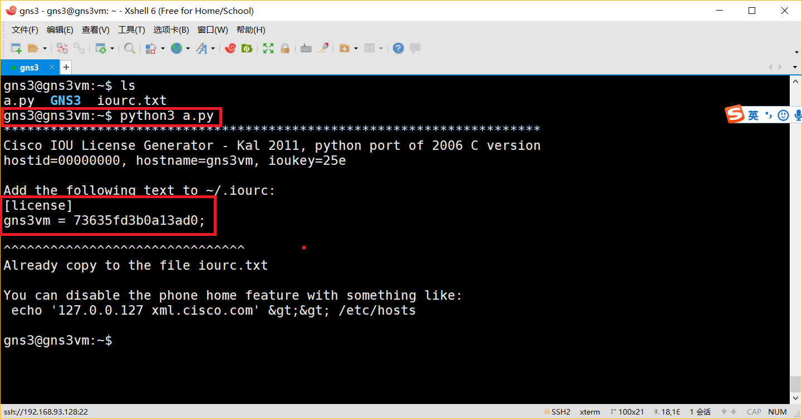<br>

我们把输出的License值粘贴复制到下图中的位置。<br>
<br>

### 里程碑二 添加IOU设备
首先我们从GNS3的官网下载LOU的配置信息。<br>
地址：[https://gns3.com/marketplace/appliance/iou-l2](https://gns3.com/marketplace/appliance/iou-l2)<br>
地址：[https://gns3.com/marketplace/appliance/cisco-iou-l3](https://gns3.com/marketplace/appliance/cisco-iou-l3)<br>

我们把下载下来的文件放到如下目录(我们以前自己创建的)：<br>
<br>

现在我们回到GNS3软件执行如下操作：<br>
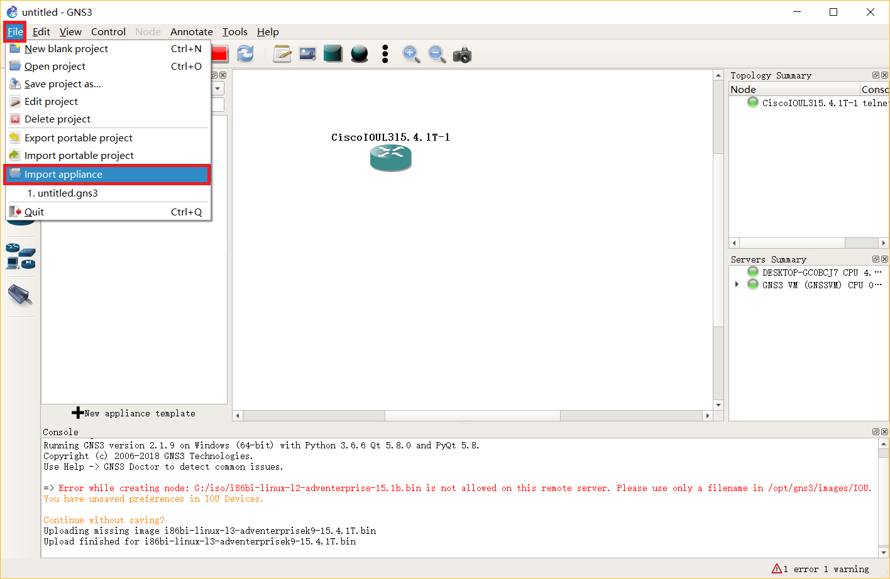<br>
<br>
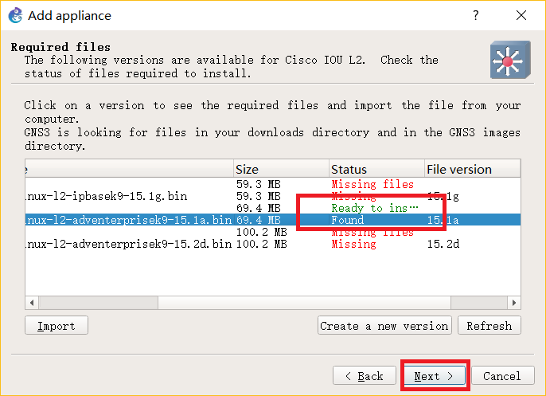<br>
对于上图的镜像文件在下面给一条连接下载：<br>
地址：[https://pan.baidu.com/s/15PC243y5UFgLb5dKC_xXRA](https://pan.baidu.com/s/15PC243y5UFgLb5dKC_xXRA)<br>
密码：6gfk<br>

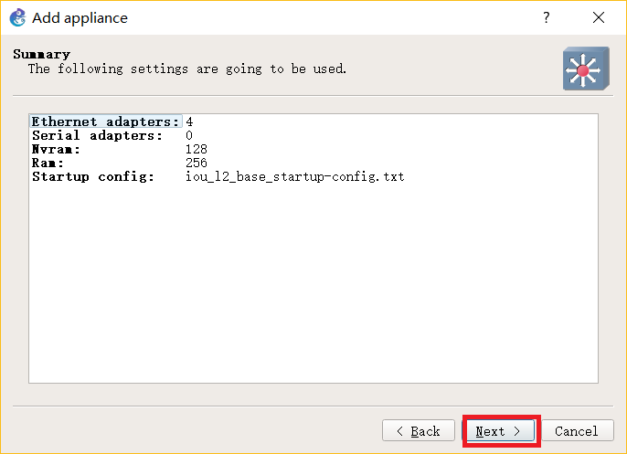<br>
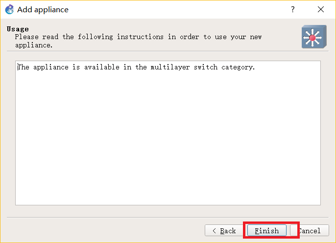<br>

### 里程碑三 测试IOU设备
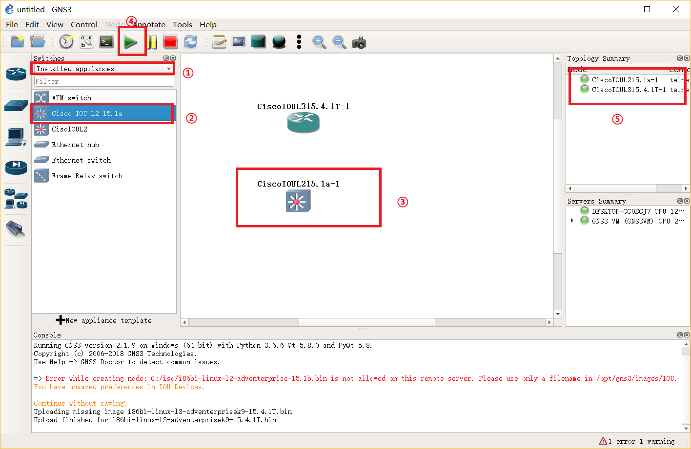<br>
如果上述操作没有任何问题，则IOU设备添加成功。<br>


#
